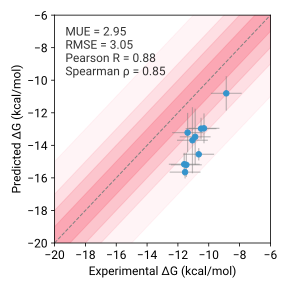
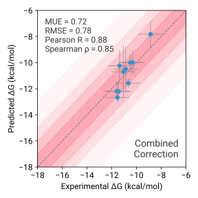

# Explanation

## Problem: Apo state in ABFEs

ABFE methods compute the absolute binding affinity of a ligand by fully decoupling it from the protein environment and comparing this to its decoupling in solution. In theory, the decoupled receptor must accurately represent the apo state. In practice it rarely does. Because simulations begin from the holo structure and decouple the ligand gradually, the per-window timescales are rarely sufficient for the binding pocket to resolvate or for the protein to escape the holo-like conformation. Since the decoupled windows represent a holo-receptor without the ligand, binding affinities are systematically overestimated. FEPA provides tools to diagnose and correct the most common manifestations of this problem.

---

## Manifestation of the Apo state problem: Pocket conformation
One manifestation of the apo state problem is through the binding pocket conformation. This is clearly seen in the Deflorian et al. A2A dataset, where all compounds are systematically overestimated.

**Figure 1:** ABFE predictions for the Deflorian et al. A2A dataset.

## Diagnosing and solving the Apo state problem:

A useful way to visualise this is to project the three conformational ensembles — apo, holo, and ABFE windows — onto a low-dimensional space defined by the principal components of pairwise Cα distances within the binding pocket. This reveals that the ABFE and holo ensembles overlap closely while the apo ensemble occupies distinct regions of conformational space, confirming that the ABFE simulations are not sampling the true apo state.

To correct for this, we compute the missing relaxation free energy as a separate thermodynamic leg using replica-exchange umbrella sampling (REUS), as illustrated in the thermodynamic scheme below.

**Figure 2:** Thermodynamic scheme illustrating the incorporation of receptor relaxation as an additional leg to correct the FEP-derived annihilation free energy.

To perform REUS, a suitable collective variable (CV) is needed. We first apply PCA to the full combined ensemble and cluster the resulting conformational space to identify distinct metastable states. Frames from the apo cluster and the final decoupled ABFE windows (vdw.20) are then extracted and used to perform a refined PCA. Because these two ensembles are structurally distinct, the variance is dominated by a single principal component, which serves as an effective 1D CV for REUS.

**Figure 3:** Workflow for CV construction. Binding pocket frames are featurised using pairwise Cα distances and projected onto PC space. Clustering identifies metastable states including the apo-like basin. Where multiple apo clusters exist, the most populated is selected. A refined PCA on the apo cluster and vdw.20 frames yields a 1D CV capturing the dominant variance between the two ensembles.

REUS and the free energy correction. REUS along this CV reveals that the vdw.20 state sits in a higher free energy well relative to the apo state. The free energy difference between these wells is the correction term applied to the ABFE estimates.

**Figure 4:** Free energy surface from REUS for compound 4h, showing two distinct wells corresponding to the holo-like and apo-like states.

Applying a single global correction derived from the combined dataset substantially improves agreement with experiment.

**Figure 5:** Improvement in ABFE predictions following the global receptor relaxation correction.

For more information please refer to the published article: 