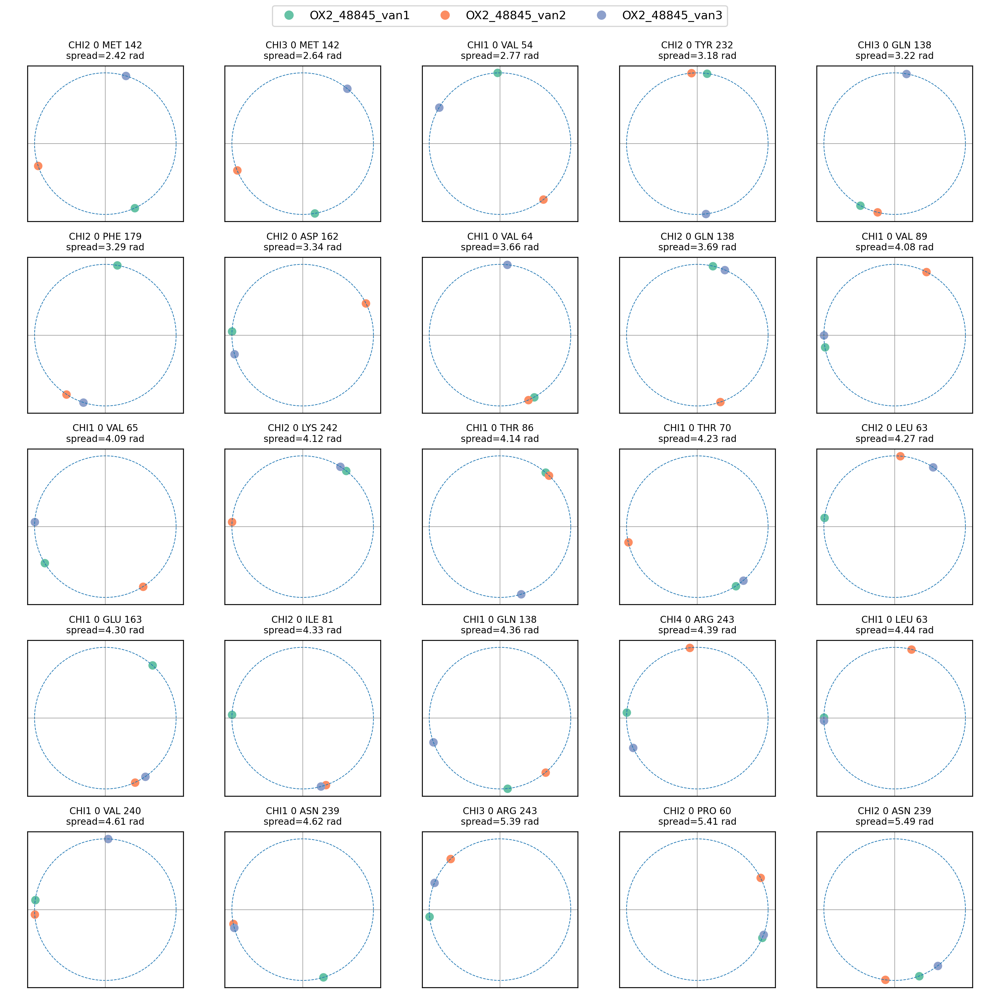

This workflow demonstrates how to use FEPA to analyze side-chain torsion angle distributions across ABFE ensembles. The procedure closely follows the feature-extraction workflow from Tutorial 1, but instead of `SelfDistanceFeaturizer`, we use `SideChainTorsionsFeaturizer` to compute χ-angle torsions for binding-pocket residues.

### 1. Loading ABFE Trajectories and Setting Up the Featurizer

We begin by loading the trajectories for the compound of interest, defining the relevant ABFE λ-windows, and preparing the EnsembleHandler:

```python
from fepa.utils.file_utils import load_config
from fepa.core.ensemble_handler import EnsembleHandler
from fepa.utils.path_utils import load_abfe_paths_for_compound
from fepa.core.featurizers import SideChainTorsionsFeaturizer

# Load configuration
config_path = os.path.join("../../config/config.json")
config = load_config(config_path)
analysis_output_dir = os.path.join("wdir")
cmp = config["compounds"][1]

# Create output directory
cmp_output_dir = os.path.join(analysis_output_dir, cmp)
os.makedirs(cmp_output_dir, exist_ok=True)

# Prepare paths
logging.info("Loading paths for compound %s...", cmp)
path_dict = load_abfe_paths_for_compound(
    config,
    cmp,
    van_list=[1, 2, 3],
    leg_window_list= [f"vdw.{i:02d}" for i in range(20, 21)] +
     [f"coul.{i:02d}" for i in range(0, 11)] + 
     [f"rest.{i:02d}" for i in range(0, 12)],
    bp_selection_string="name CA and resid " + config["pocket_residues_string"],
    apo=True,
)

# Load trajectories
logging.info("Loading trajectories for compound %s ...", cmp)
ensemble_handler = EnsembleHandler(path_dict)
ensemble_handler.make_universes()

# Featurize
logging.info("Featurizing binding pocket torsions ...")
sct_featurizer = SideChainTorsionsFeaturizer(ensemble_handler=ensemble_handler)
sct_featurizer.featurize()

# Save features
logging.info("Saving features for compound %s ...", cmp)
sct_featurizer.save_features(cmp_output_dir, overwrite=True)

```

This extracts χ-angle torsions for all binding-pocket residues across the apo and ABFE ensembles defined above.

### 2. Annotating and Visualizing Side-Chain Torsion Distributions

We can now load the computed feature table and annotate each frame with its simulation type (apo vs. ABFE). This metadata is used to color the distributions in the plot.

```python
import pandas as pd

# Loading the featured column
features_df = pd.read_csv(
    os.path.join(cmp_output_dir, f"SideChainTorsions_features.csv")
)

# Function to get the simulation type
def get_sim_type(ensemble):
    if "apo" in ensemble:
        return "apo"
    if "coul" in ensemble or "vdw" in ensemble or "rest" in ensemble:
        match = re.search(r"van_(\d+)", ensemble)
        if match:
            return f"abfe"
        else:
            raise ValueError(f"van not found in ensemble: {ensemble}")
    else:
        return "holo"

# Annotate sim_type for features_df
features_df["sim_type"] = features_df["ensemble"].apply(
    get_sim_type
)
```

We then generate torsion-angle histograms using FEPA’s built-in visualization utility:

```python
# Plot sidechain distribution
plot_sidechain_distribution(
    df=features_df,
    ensembles=["abfe", "apo"],
    colorby="sim_type",
    output_file=os.path.join(
        cmp_output_dir, f"{cmp}_sidechain_histograms_simtype_abfe_apo.png"
    ),
    ncols=4,
)
```


**Figure 1.** Side-chain angle distributions for the apo and ABFE ensembles.

### Other useful utilities: Comparing torsions of starting poses

Often times, differences in sidechain torsions between starting frames of ABFEs result in huge differences in the binding affinity as independant runs are sampling different conformations. To account for this, we must be mindful of the sidechain torsion differences between different repeats. This can be done by using the `read_protein_sidechain_torsions` function from PENSA.

```python
from pensa.features import read_protein_sidechain_torsions

df_list = []

# Get gro paths for different vanilla runs
for van in van_runs:
    gro_path = f"OX2_{cmp}/abfe_van{van}_hrex_r1/complex/complex.gro"
    name, data = read_protein_sidechain_torsions(
        gro_path,
        gro_path,
        selection=bp_selection_string,
    )
    df = pd.DataFrame(data, columns=name)
    df["structure"] = f"OX2_{cmp}_van{van}"
    df_list.append(df)

# Combine all dfs in df_list into a single df
torsions_df = pd.concat(df_list, ignore_index=True)
```

This could then be visualized with the `plot_torsions_to_png` function which plots the torsions in decending order of spread between the different structures.

```python
from fepa.utils.plot_utils import plot_torsions_to_png

# Plot the dataframe
plot_torsions_to_png(
    torsions_df, savedir="torsion_plots"
)
```


**Figure 2.** Torsions shown in decreasing order of their variation across different starting frames.
