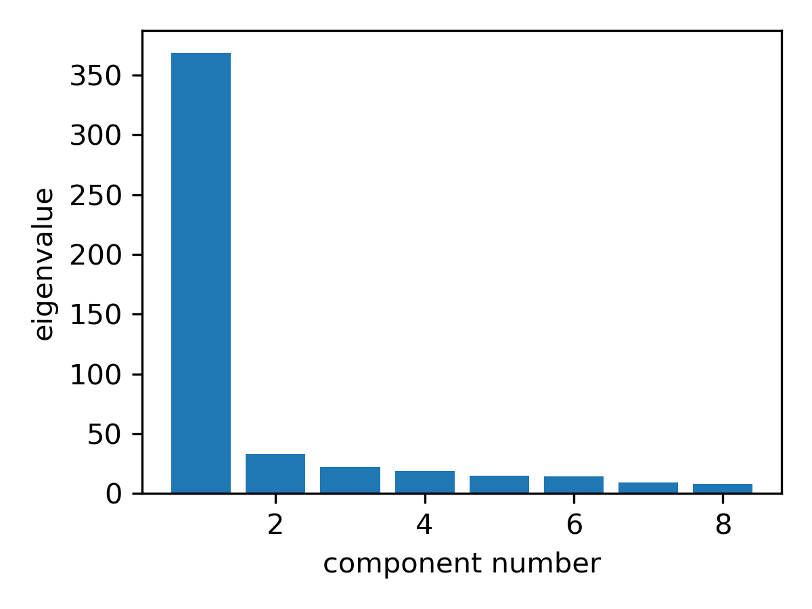
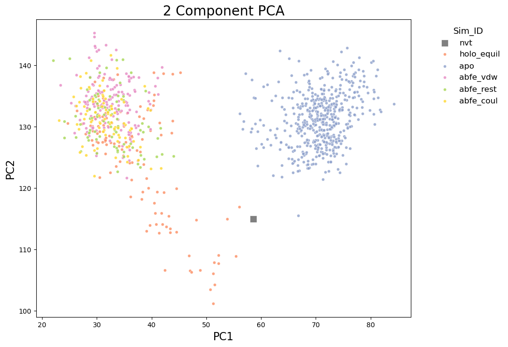

# Featurizing ABFEs

This tutorial is designed to the user to introduce fepa by analyzing MD data from a set of simulations of the ligand 42922 (from the Deflorian et al set 1 datset) bound to the Orexin 2 Receptor. Specifically, we will compare the holo, apo and ABFE trajectories. Through this comparison, we will demonstrate that the protein’s binding pocket adopts distinct conformations between the final lambda windows (where the ligand is fully annihilated) of the ABFE simulation and the long apo simulation of the receptor.

This tutorial is followed by Tutorial 2 where we will use FEPA to set up REUS simulations to estimate the free energy of this conformational change from the holo like  to apo like states. This tutorial uses MDAnalysis, MDtraj and the PENSA package for analysis, GROMACS for simulation and Plumed for enhanced sampling. It is assumed that the user is familiar with setting up and analyzing MD simulations run with GROMACS and Plumed. 
## Loading the config file

ABFE simulations produce multiple MD trajectories over different lamba windows. In our case, we have 44 lambda windows (11 Coulomb, 12 Restrains and 22 Van-der-Walls) plus the holo and the apo simulations that we have to analyse. To make things easier when parsing paths to the topology and coordinate files of these trajectories, we use a config file. The config file is json-formatted and contains all the information necessary to read the simulation trajectories. Here is a sample config file that I use for this tutorial:

```json
{
    "base_path": "deflorian_set_1_j13_v1",
    "abfe_window_path_template": "deflorian_set_1_j13_v1/OX2_{CMP_NAME}/abfe_van{REP_NO}_hrex_r{ABFE_REP_NO}/complex/{LEG_WINDOW}/{STAGE}",
    "vanilla_path_template": "deflorian_set_1_j13_v1/OX2_{CMP_NAME}/vanilla_rep_{REP_NO}",
    "apo_path_template": "deflorian_set_1_j13_v1/apo_OX2_r{REP_NO}",
    "compounds": [
        "42922",
    ],
    "pocket_residues_string": "12  54  57  58  59  60  61  62  63  64  65  70  71  78  81  82  83  85  86  89 138 142 160 161 162 163 175 178 179 182 183 232 235 236 239 240 242 243 261 265 268 269"
}
```

The pocket_residues_string variable is a string that stores the residue ids of all the proteins residue that have any atom within 6 A of the ligand. The JSON file is then loaded into a dictionary with the function `load_config` from `fepa.utils.file_utils`
## Loading MD trajectories 

Now that we have the template paths to all the simulations: Apo EQ, Holo EQ and ABFE, we can use the function `load_abfe_paths_for_compound` from fepa.utils.path_utils to generate a `path_dict` dictionary that contains all the MD file paths for a single compound as follows:

```python
cmp = config['compounds'][0]
path_dict = load_abfe_paths_for_compound(
            config,
            cmp,
            van_list=[3], # Loading only vanilla simulation 3
            leg_window_list=[f"coul.{i:02d}" for i in range(0, 11,2)] + [f'vdw.{i:02d}' for i in range(0, 21,2)] + [f'rest.{i:02d}' for i in range(0, 12,2)], # Loading only every other lambda window
            bp_selection_string="name CA and resid " + config["pocket_residues_string"],
            apo=True,
        )
```

The `load_abfe_paths_for_compound` function has various arguments that allow the user control over what simulation paths are loaded. For more information, please refer to the API. 

Now that we have the path_dict, it is time for us to load the trajectories themselves. We will be using the EnsembleHandler class from fepa.core.ensemble_handler to do this. EnsembleHandler is a neat way of storing and manipulating the trajectories from multiple ensembles with some built in functions for sanity checks. Internally EnsembleHandler stores the trajectories as dictionary of MDA universes.  

TODO: Need to remove ensemblehandler and just use universe dict

```python
# Load trajectories
ensemble_handler = EnsembleHandler(path_dict)
# Make universes
ensemble_handler.make_universes()
logging.info("Making universes for compound %s...", cmp)
# Check for BP residue consistency across all the trajectories
logging.info("Checking residue consistency for compound %s...", cmp)
```
## Featurizing MD trajectories

We will now be featurizing these trajectories by their pairwise C-alpha distances in the binding pocket using the function `SelfDistanceFeaturizer` from `fepa.core.featurizers`. `SelfDistanceFeaturizer` computes and stored all possible pairs of distances between the C-alpha atoms of the binding pocket residues. The class also has `save_features` and `load_features` functions that help save the features as a csv file to make sure the time consuming featurization step need not be repeated every run.

TODO: Make sure the binding pocket selection is consistent

```python
# Make a folder for the analysis output
cmp_run_dir = f'analysis/{cmp}/'
if !(os.path.exists(cmp_run_dir)):
    os.mkdir(cmp_run_dir)

# Featurize and save features
featurizer = SelfDistanceFeaturizer(ensemble_handler)
featurizer.featurize()
featurizer.save_features(input_dir=cmp_existing_run_dir)
```
## Visualizing ensembles 

Saving the features in a csv format gives us the flexibility to analyse it as required. For the purpose of this tutorial, we will be looking at how our features capture the difference between the apo, the holo and the abfe ensembles. To do this we reduce the dimensions of the features data using the `PCADimReducer` class from `fepa.core.dim_reducers`. FEPA also supports other dimensionality reduction techniqeus like UMAP and tSNE. In fact UMAP is better able to resolve the differences in binding pocket configurations between different ensembles. We will be doing PCA here as it also doubles up as a nice CV to bias when performing umbrella sampling later.

```python


# Dimensionality Reduction
logging.info("Performing dimensionality reduction for compound %s...", cmp)
dimreducer = PCADimReducer(featurizer.get_feature_df(), n_components=8)
dimreducer.reduce_dimensions()
dimreducer.calculate_projections()
dimreducer.save_projection_df(
    save_path=os.path.join(cmp_output_dir, "pca_projection_df.csv")
)
```

First we plot the eigen values of all the PCs to understand what percentage of variance is captured by the first few PCs:

```python
logging.info("Plotting PCA eigenvalues for compound %s...", cmp)
plot_eigenvalues(
    pca_object=dimreducer.get_pca(),
    n_components=8,
    save_path=os.path.join(cmp_output_dir, "eigenvalues.png"),
)
```



*Figure 1: PCA eigenvalues for the binding-pocket Cα self-distance features.*

Here, most of the variance is captured by PC1. However, this may not always be the case. Therefore, for this tutorial, we will use PC1 and PC2 together, as they collectively capture the majority of the variance. To improve visualization, we define a new column in `projection_df` called `simtype`, which groups the ensembles into broader categories: `abfe_coul`, `abfe_vdw`, `abfe_rest`, `holo_equil`, `apo`, and `nvt`.

```python
# Further labelling the ensembles
projection_df = dimreducer.get_pca_projection_df()
# Add another column called simtype based on ensemble
def get_simtype(ensemble_name: str) -> str:
    if "van" in ensemble_name:
        if 'nvt' in ensemble_name:
            return "nvt"
        if "coul" in ensemble_name:
            return "abfe_coul"
        elif "vdw" in ensemble_name:
            return "abfe_vdw"
        elif "rest" in ensemble_name:
            return "abfe_rest"
        else:
            return "holo_equil"
    elif "apo" in ensemble_name:
        return "apo"
    else:
        return "other"
projection_df["simtype"] = projection_df["ensemble"].apply(get_simtype)
```

We can visualize the dimensionality-reduced data using the `DimRedVisualizer` class. In the example below, we plot the first two principal components, colored by simulation and time. We also highlight NVT, as it represents the initial crystal structure after energy minimization.

```python
logging.info("Visualizing compound %s...", cmp)
dimred_visualizer = DimRedVisualizer(projection_df=projection_df, data_name="PCA")
dimred_visualizer.plot_dimred_sims(
    save_path=os.path.join(cmp_run_dir, "pca_components_ensemble_noapo.png"),
    highlights=[f"{cmp}_nvt"],
)
dimred_visualizer.plot_dimred_time(
    save_path=os.path.join(cmp_run_dir, "pca_components_time_noapo.png")
)
dimred_visualizer.plot_dimred_sims(
    column="simtype",
    save_path=os.path.join(cmp_run_dir, "pca_components_simtype.png"),
)
```


*Figure 2: Simulation frames in PC-space (PC1 vs PC2), colored by simtype*
## Clustering ensembles

In Figure 2, frames from the ABFE simulations closely resemble those from the holo equilibrium simulation, forming two distinct clusters: apo-like and holo-like. We will be clustering them using `cluster_pca`. After clustering, we can estimtate the data point that is closest to the center with the function `make_ensemble_center_df` which returns a `DataFrame` containing the details of the frame closest to the centroid in PC space. 

```python
# Cluster the projection df
pca_projection_df_clustered = cluster_pca(
    projection_df, n_clusters=3, n_components=3
)
# Ensemble center df
ensemble_center_df = make_ensemble_center_df(
    pca_projection_df_clustered, key="cluster"
)
```

We then visualize the clustered data with ensemble centers as follows:

```python
# Visualization of clustered data
dimred_visualizer_clustered = DimRedVisualizer(
    projection_df=pca_projection_df_clustered, data_name="PCA"
)
dimred_visualizer_clustered.plot_dimred_cluster(
    save_path=os.path.join(
        cmp_run_dir, "subset_pca_components_clusters_w_center.png"
    ),
    centroid_df=ensemble_center_df,
    cluster_column="cluster",
)
```


*Figure 3: Clustered PCA data with ensemble centers marked by an X.*
## Visualizing differences across clustered ensembles

With two distinct clusters identified, we can compare them across different features by computing the Jensen–Shannon (JS) entropy for each feature. The code below plots feature-wise histograms for cluster 0 and cluster 1, annotated with their JS entropy values:

```python
# Copy the cluster labels from pca_projection_df_clustered to feature_df
feature_df_w_clusters = featurizer.get_feature_df().copy()
feature_df_w_clusters["cluster"] = pca_projection_df_clustered["cluster"].values


# Compute feature-level histograms and JS entropy between clusters 0 and 1
histograms = compute_histograms(
    feature_df_w_clusters,
    "cluster",
    0,
    1,
    num_bins=50,
    feature_column_keyword="DIST",
)

rel_ent_dict = compute_relative_entropy(
    feature_df_w_clusters,
    ensemble1=0,
    ensemble2=1,
    num_bins=50,
    key="cluster",
    feature_column_keyword="DIST",
)

plot_jsd_histograms(
    histograms,
    rel_ent_dict,
    top_n=16,
    save_path=os.path.join(cmp_run_dir, "jsd_cluster0_vs_cluster1.png"),
)
```


*Figure 4: Histograms of the top 16 features showing the highest Jensen–Shannon divergence between clusters 0 and 1.*

We then save the ensemble center frames as GRO files to compare structures in molecular visualization tools such as PyMOL:

```python
# Save ensemble center frames as GRO files
for _, row in ensemble_center_df.iterrows():
    center_ensemble = row["ensemble"]
    center_timestep = row["timestep"]
    print(f"Ensemble: {center_ensemble}, Timestep: {center_timestep}")

    # Load trajectories
    ensemble_handler.make_universes()

    # Export the frame corresponding to the ensemble center
    ensemble_handler.dump_frames(
        ensemble=center_ensemble,
        timestep=center_timestep,
        save_path=f"subset_cluster_{int(row['cluster'])}_center.gro",
    )

```

The analysis in this tutorial can also be performed using FEPA’s workflow classes, which provide minimal-boilerplate interfaces for running standard ABFE analysis. These workflows reproduce the same binding pocket analysis shown here, but with far less user-written code. You can find ready-to-use workflow examples in the `fepa/examples` directory.