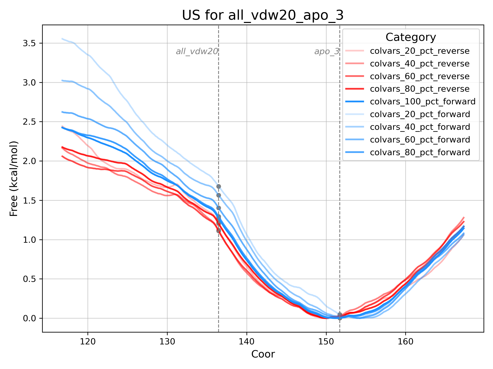

# Setting up REUS

In Tutorial 2, we build on the concepts learned in Tutorial 1, where the apo and holo states were shown to form distinct conformational clusters. Using the data provided in the [template], we will set up Replica Exchange Umbrella Sampling (REUS) simulations to estimate the free energy of the conformational transition from holo to apo, using the principal component (PC) 1 as the collective variable (CV). We will achieve this by morphing the protein from one state to another, equilibrating the system, and then running REUS to sample the transition.

## Preparing the plumed.dat file

The first step in performing umbrella sampling with GROMACS and PLUMED is to create a plumed.dat file that defines the collective variable (CV), and the positions of the umbrella sampling restraints. To do this, we load the feature CSV files, initialize a DimReducer object, and extract the corresponding PCA object to define the CV based on pairwise Cα distances.

```python
# Load Features df and reduce dimensions
feature_df = pd.read_csv(os.path.join("md_data", "top_features_apo_vdw.20.csv"))
dimreducer = PCADimReducer(feature_df, n_components=8)
dimreducer.reduce_dimensions()
dimreducer.calculate_projections()
pca_projection_df = dimreducer.get_pca_projection_df()
# Use PCA from dimreducer to write plumed file
top_features = feature_df.filter(regex="DIST", axis=1).columns
write_plumed_file(
    sdf_names=top_features,
    top_features_pca=dimreducer.get_pca(),
    save_path="plumed.dat",
    molinfo_structure="../reference.pdb",  # fix molinfo here
)
```

The PLUMED input file should look like this:

```
MOLINFO STRUCTURE=../reference.pdb
d1: DISTANCE ATOMS=@CA-236,@CA-243
d2: DISTANCE ATOMS=@CA-175,@CA-243
d3: DISTANCE ATOMS=@CA-138,@CA-243
.
.
.
d200: DISTANCE ATOMS=@CA-61,@CA-70
# Create the dot product
dot: COMBINE ARG=d1,d2,d3...d200 COEFFICIENTS=0.095,0.152,0.133...0.057,0.054,0.032 PERIODIC=NO
CV: MATHEVAL ARG=dot FUNC=10*x PERIODIC=NO
PRINT ARG=CV FILE=COLVAR STRIDE=1
# Put position of restraints here for each window
restraint: RESTRAINT ARG=CV AT=@replicas:$RESTRAINT_ARRAY KAPPA=$KAPPA
PRINT ARG=restraint.* FILE=restr
```
Note that $RESTRAINT_ARRAY is a placeholder for the harmonic restraint positions in CV space. When defining these positions, ensure they align with the direction of the structural morph. By convention, we transition from vdw.20 to apo structures. To assign restraints correctly, identify the ensemble with the lowest PC value and order the restraints from min to max (or vice versa) accordingly.

```python
# Pair of ensembles to compare
pair = ("vdw.20", "apo")
# Get mean PC1 for the two ensembles
mean_pc1_ensemble1 = pca_projection_df[pca_projection_df["state"] == pair[0]][
    "PC1"
].mean()
mean_pc1_ensemble2 = pca_projection_df[pca_projection_df["state"] == pair[1]][
    "PC1"
].mean()
logging.info(
    f"Mean PC1 for {pair[0]}: {mean_pc1_ensemble1}, Mean PC1 for {pair[1]}: {mean_pc1_ensemble2}"
)
# Get the restraint array based on the two ensembles
PC1_min = pca_projection_df["PC1"].min()
PC1_max = pca_projection_df["PC1"].max()
# If min PC1 is from ensemble 1, then the restraint array should be from PC1_min to PC1_max
if mean_pc1_ensemble1 < mean_pc1_ensemble2:
    restraint_array = np.linspace(PC1_min, PC1_max, 24)
elif mean_pc1_ensemble1 > mean_pc1_ensemble2:
    restraint_array = np.linspace(PC1_max, PC1_min, 24)
```

Once the restraint array is prepared, we write it to the PLUMED file using the write_plumed_restraints function:

```python
# Write the restraint array to the plumed file
write_plumed_restraints(
    plumed_file="plumed.dat",
    restraint_centers=restraint_array,
    kappa=5,
)
```

The restrain line on plumed.dat file must now be an array of distance restraints that looks like this:

```
restraint: RESTRAINT ARG=CV AT=@replicas:116.856,119.047,121.239...167.262 KAPPA=5
```

## Morphing with memento

For this tutorial, the GRO files representing the vdw.20 and apo states are provided in the data folder, prepared in the same way as in Tutorial 1. The plumed.dat file has also been prepared. The next step for REUS is to generate intermediate protein conformations using [Memento](https://pubs.acs.org/doi/10.1021/acs.jctc.3c00140) (JCTC, 2023)
. FEPA provides a class for easy access to Memento.

Using FEPA’s `memento_workflow` class, we can perform the protein morphing. A Memento directory is needed to store morphs for each entry in initial_target_gro_dict, and an apo_template path must be provided, containing the topology and MDP files required for equilibrium simulations.


```python 
# Declaring variables:
memento_dir = "/biggin/b211/reub0138/Projects/orexin/deflorian_set_1_j13_v1_memento"
# Defining pairs
pair = ("all_vdw20", "apo_3")
all_vdw20_gro_file = "/biggin/b211/reub0138/Projects/orexin/deflorian_set_1_j13_v1/analysis/a12_dimreduce_vdw.20/subset_cluster_1_center.gro"
apo_3_gro_file = "/biggin/b211/reub0138/Projects/orexin/deflorian_set_1_j13_v1/analysis/a12_dimreduce_vdw.20/subset_cluster_2_center.gro"
template_path = "/biggin/b211/reub0138/Projects/orexin/deflorian_set_1_j13_v1_memento/apo_template"  # Make sure no water and no ions in the template topology file
# Setup Memento folders
memento_flow = memento_workflow(
    memento_dir=memento_dir,
    initial_gro=all_vdw20_gro_file,
    target_gro=apo_3_gro_file,
    initial_name=pair[0],
    target_name=pair[1],
    template_path=template_path,
    run_name="memento_run_v1",
    n_residues=296,
)
```

We can use the workflow functions to perform each step. First, `prepare_memento` sets up the files required by Memento. Then, `run_memento` executes the morphing. `run_memento` requires the protonation states of all histidines in the format expected by GROMACS pdb2gmx (0 for HID, 1 for HIE, 2 for HIP, 3 for HIS1). Additionally, the indices of CYX residues must be provided, as Memento cannot process them automatically.

```python
# Preparing memento input
memento_flow.prepare_memento()
# Running memento
memento_flow.run_memento(
    template_path=template_path,
    last_run="memento_run_v1",
    protonation_states=[1, 1, 1, 2, 1, 2],
    cyx_residue_indices = []
)
```

## Running Equilibration

This step may take some time. Once complete, we can set up equilibration simulations with Memento by providing a job script path, which can be modified to suit the specific HPC system.

```python
# Running analysis
memento_flow.prepare_equil_simulations(
    job_script_template="/biggin/b211/reub0138/Projects/orexin/lenselink_a2a_memento_v1/job_vanilla_ranv_equil_arr_template.sh"
)
```

After running prepare_equil_simulations, individual boxes for each morph are created. We then simulate each box to relax the side chains by submitting the job to our HPC. Once complete, we can proceed to the REUS simulations.

## Preparing REUS

Once the equilibration simulations are complete, use FEPA’s `reus_umbrella_sampling_workflow` class to set up umbrella sampling in the same working directory. The number of windows can be adjusted via `n_windows` (24 is typically sufficient). If the residue IDs in the plumed.dat file does not match those in the MD GRO files, FEPA requires the correct offset to be set via the `plumed_resid_offset` parameter.

```python
import logging
from pathlib import Path
from fepa.flows.reus_flows import (
    reus_umbrella_sampling_workflow,
)

sim_path = "wdir/all_vdw20_apo_3/memento_run_v1/wdir/boxes/sim0"
wdir_path = Path(sim_path).parents[1]
plumed_path = "plumed.dat"
simname = "all_vdw20_apo_3"
initial_gro = "md_data/cluster_1_center.gro"
final_gro = "md_data/cluster_2_center.gro"
submission_script_template_arr = "md_data/job_reus_template.sh"
print(f"wdir_path: {wdir_path}, plumed_path: {plumed_path}")
umbrella_sampler = reus_umbrella_sampling_workflow(
    wdir_path=wdir_path,
    plumed_path=plumed_path,
    submission_script_template_arr=submission_script_template_arr,
    start=simname.split("_")[0] + "_" + simname.split("_")[1],
    end=simname.split("_")[2] + "_" + simname.split("_")[3],
    reus_folder_name="reus_v1",
    n_windows=24,
    plumed_resid_offset=0,
    initial_gro=initial_gro,
    target_gro=final_gro,
)
umbrella_sampler.setup_simulations(exist_ok=True)
```
## Analyzing REUS

Once your REUS system is set up, you can analyze the results using the workflow:

```python
umbrella_sampler.prepare_wham()
umbrella_sampler.run_wham()
umbrella_sampler.analyse_us_hist(range=(90, 180), colvar_prefix="COLVAR")
umbrella_sampler.get_initial_final_CVs()
umbrella_sampler.plot_free_energies(
    units="kcal",
)
```

This prepares and runs WHAM on the histograms and generates the free energy curves.



*Figure 1: Free energy curves from the tutorial simulations. The CV values of apo and holo structures are marked with gray dotted lines. Different lines represent curves computed using varying proportions of data to assess convergence.*